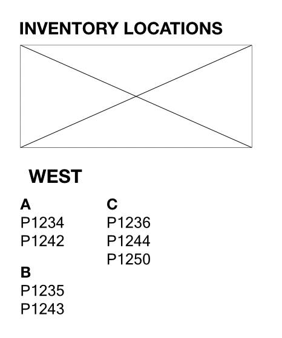

### Story
Where I work our warehouses are fields and vacant parking lots. There are 3000 total items that we are tracking.  1500 items were manufactured and moved to our facilities and will be consumed by the product we are manufacturing. As these items are consumed the final product is then moved out of the factory and into these warehouses. 

The products we manufacture are the size of a large aircraft wing or medium-size truck. 

Some items have been pulled from the production line, because of technical issues that cannot be solved, others are moved from the production line because of local-optima of upstream processes resulting in excess Work-In-Progress. 

Monthly drone photos are taken of our open-air warehouses and a manual count is taken. This manual count is then transcribed into an excel spreadsheet. 

### Prototype View

### Data
This table is representative of how that data is structured. 

| code  | warehouse | section | item |
| :---- | :-------- | :------ | :--- |
| P1233 | North     | A       | wing |
| P1238 | North     | B       | wing |
| P1237 | North     | C       | wing |
| P1238 | North     | D       | wing |
| P1245 | North     | E       | wing |
| P1246 | North     | F       | wing |
| P1232 | South     | 1       | box  |
| P1236 | South     | 2       | box  |
| P1237 | South     | 3       | box  |
| P1239 | South     | 3       | box  |
| P1240 | South     | 3       | box  |
| P1241 | South     | 4       | wing |
| P1247 | South     | 5       | wing |
| P1248 | South     | 5       | wing |
| P1249 | South     | 5       | wing |
| P1234 | West      | A       | box  |
| P1235 | West      | B       | box  |
| P1236 | West      | C       | wing |
| P1242 | West      | A       | wing |
| P1243 | West      | B       | wing |
| P1244 | West      | C       | wing |
| P1250 | West      | C       | wing |

### Rails Server
bin/dev

